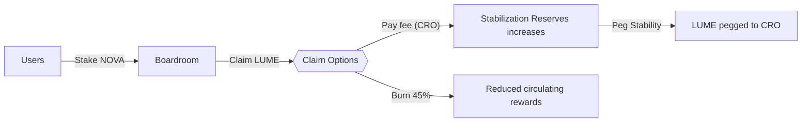
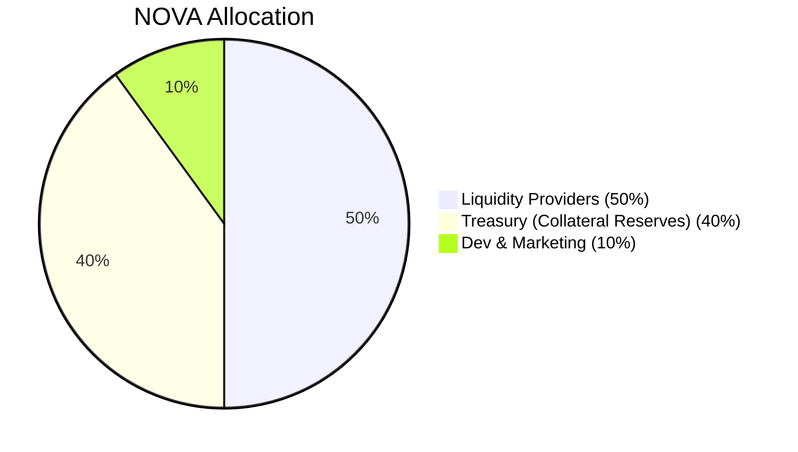
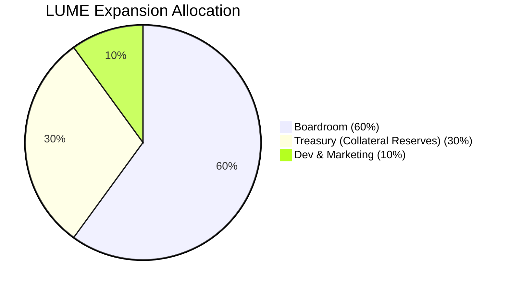

# 💎 LumeFi: Radiating Stability & Innovation on Cronos
## 🚀 Official Launch Announcement by FrogsClub

We're thrilled to announce the official launch of **LumeFi**, a next-generation DeFi protocol on the Cronos network, powered by [**FrogsClub**](https://www.frogsclub.xyz/). LumeFi combines AI-driven governance, elastic supply tokenomics, and robust CRO-backed Treasury management to create a sustainable and rewarding DeFi ecosystem.

---

## 📅 Launch Timeline & Key Milestones

| Event                   | Date & Time (UTC)        | Duration |
|-------------------------|--------------------------|----------|
| **Genesis Pool (LUME)** | March 23, 2025, 12:00 PM | 15 days  |
| **NOVA Farming Pool**   | March 27, 2025, 12:00 PM | Ongoing  |
| **Boardroom Launch**    | March 30, 2025, 12:00 PM | Ongoing  |

---

## 🎁 Genesis Pool Reward Details

**Duration:** March 20–April 4, 2025 (15 days)

| Period          | LUME Rewards          | Withdrawal Fee |
|-----------------|-----------------------|----------------|
| Days 1–5        | 120,000 LUME          | 3%             |
| Days 6–10       | 80,000 LUME           | 2%             |
| Days 11–15      | 40,000 LUME           | 1%             |
| After April 4   | No additional rewards | No fee         |

Withdrawal fees collected during Genesis will directly fund the **Treasury**, supporting LUME’s peg stability.

---

## 🌾 NOVA Farming Pool

- **Starts:** Tuesday, March 27, 2025 (12:00 PM UTC)
- **PSM Fees:** 15% (Week 1), 30% thereafter, adjustable by NOVA governance.

All CRO collected from fees reinforce the **Treasury**, ensuring LUME maintains stable collateral backing.

---

## 🏛️ Boardroom (NOVA Staking & Rewards)

**Launch:** Thursday, March 30, 2025 (12:00 PM UTC)

### ⚙️ Mechanics:
- **Staking & Unstaking:** Fee-free.
- **Withdrawal Waiting Period:** 8 epochs (48 hours), cancellable anytime with immediate restaking.

### 🎖️ Reward Claim Structure:
- **Reward Claim Lock:** 2 epochs after staking or claiming.
- **Reward Expiry:** Rewards expire after 60 hours if unclaimed (burned automatically).

**🎯 Claim Options:**
- **Claim with Burn:** Instantly receive 55% rewards (45% burned).
- **Claim with PSM Fee:** Instantly receive 100% rewards, paying a 30% CRO fee (governance adjustable).

### 🔥 Loyalty Discounts (CRO fee):
- Stake NOVA continuously ≥ 15 days (60 epochs): **10% discount**
- Stake NOVA continuously ≥ 45 days (180 epochs): **20% discount**
- Stake NOVA continuously ≥ 180 days (720 epochs): **30% discount**

---

## 📊 System Overview

- Users deposit **WCRO** and selected LP tokens into the **Genesis Pool** to earn **LUME** tokens.
- Post-Genesis, users provide liquidity pairs (**LUME/CRO**, **NOVA/CRO**) in the ongoing **NOVA Farming Pool** to earn **NOVA** tokens.
- **NOVA** can be staked in the **Boardroom** for continuous **LUME** rewards.
- Boardroom rewards (**LUME**) can be claimed immediately (55% reward, 45% burned) or fully (100%) by paying a CRO fee directed to the **Treasury**.
- The **Treasury** backs the LUME peg with tangible CRO assets, actively ensuring price stability.

---

## 🧩 Tokenomics Overview

### 💠 LUME Token (Elastic Supply):
- **Pegged to CRO**
- **Daily Rebase:** Automatically adjusts supply (up to +1% expansion / -2% contraction) if TWAP deviates from the peg range (0.98–1.18 CRO).

### 🎖️ NOVA Token (Governance Token):
**Max Supply:** 21,000 NOVA

**NOVA Allocation:**
- **50%** Liquidity Providers (10,500 NOVA), distributed over 2 years, AI-governed.
- **40%** Treasury (84,000 NOVA), linear vesting over 2 years.
- **10%** Dev & Marketing (2,100 NOVA), linear vesting over 2 years.

*(Pie Chart to be added here manually.)*

---

## 🚧 Robust Stability Mechanisms: Ensuring Peg Stability

Unlike traditional protocols reliant solely on bonds (which have proven insufficient), LumeFi employs multi-layered mechanisms managed by the FrogsClub Treasury for exceptional stability:

### 📈 Expansion Phase (LUME above peg):

- **Supply Expansion:** New LUME minted, increasing supply, easing price toward peg.
- **Treasury Action:** Excess minted LUME strategically sold for CRO, increasing Treasury reserves.

### 📉 Contraction Phase (LUME below peg):

- **Elastic Rebasing:** Automatic daily negative rebases (up to -2%) reduce supply, driving LUME price upward.
- **Collateral Redemption:** Users burn LUME to redeem CRO directly from the Treasury, reducing circulating supply.
- **Treasury Buybacks:** Treasury utilizes accumulated CRO reserves to repurchase undervalued LUME, supporting price recovery.

---

## 📌 LUME Expansion Allocation (When Above Peg)

| Allocation              | Percentage |
|-------------------------|------------|
| **Boardroom Rewards**   | 60%        |
| **Treasury (Collateral)**| 30%       |
| **Dev & Marketing**     | 10%        |

---

## 🐸 Revenue Sharing for FrogsClub (FROG holders)

LumeFi is proudly supported by FrogsClub. Revenue generated and accumulated in the Treasury from LumeFi’s operations will be shared passively with **FROG holders**, rewarding the FrogsClub community for their continued support and participation.

**How Revenue is Shared:**
- Profits from Treasury growth and protocol operations distributed periodically.
- Distribution mechanics and schedules will be transparently communicated and governed by FrogsClub DAO.

---

## 🤖 AI Governance & Transparency

LumeFi’s AI-driven governance provides transparent bi-weekly updates on:
- NOVA reward rate adjustments.
- Maximum LUME expansion rates.
- Treasury management decisions.
- Community governance oversight ensures optimal outcomes.

---

## 🚀 Upcoming Enhancements

Based on expert feedback, upcoming enhancements include:
- **lfUSD Stablecoin (USDC-Pegged):** Introducing diversified stability and rewards.
- **Diversified Collateral:** Adding USDC and ETH for enhanced risk management.
- **Extended Reward Expiry & Notifications:** Improved claim windows and automated notifications.
- **Educational & Community Engagement:** Tutorials, FAQs, AMAs, and loyalty incentives.

---

## 🌟 Why LumeFi Stands Apart

- **Real CRO-backed Treasury:** Robust collateral backing LUME’s peg.
- **Elastic Supply:** Daily rebases minimize volatility.
- **AI-Governed Transparency:** Clear bi-weekly governance communications.
- **Unique Claim & Loyalty Structures:** Innovative incentives for long-term participants.
- **Revenue Sharing to FROG Holders:** Direct value return to FrogsClub community members.

---

## 🗺️ Roadmap & Future Vision

Our vision includes:
- **lfUSD Stablecoin** (USDC pegged)
- Multi-asset collateral integration
- Cross-chain interoperability
- Expanded community education and governance tools

---

## 🌐 Connect with LumeFi & FrogsClub:

- **LumeFi Website:** [lume.finance](https://lume.finance)
- **FrogsClub:** [frogsclub.xyz](https://www.frogsclub.xyz/)
- **Twitter:** *(coming soon)*
- **Telegram & Discord:** *(links coming soon)*

Together with FrogsClub, let's illuminate the future of decentralized finance on Cronos.

**🐸🌟 Welcome to LumeFi—Where Stability Meets Innovation! 🌟🐸**