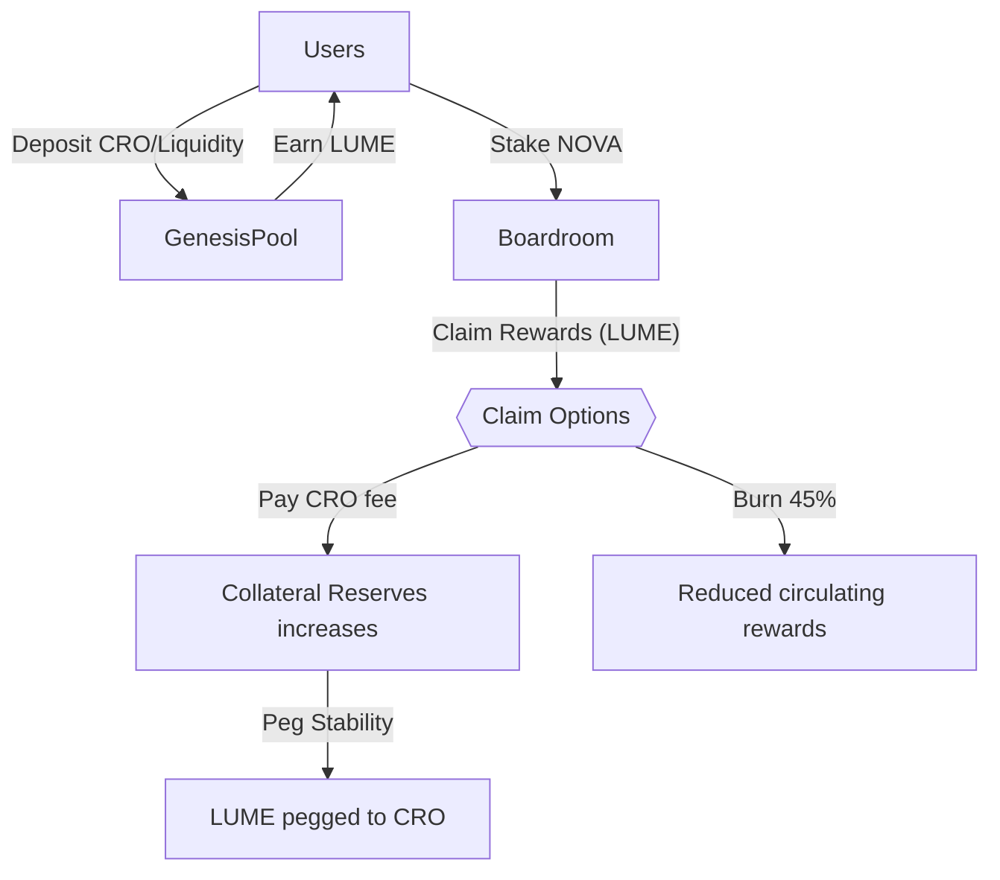
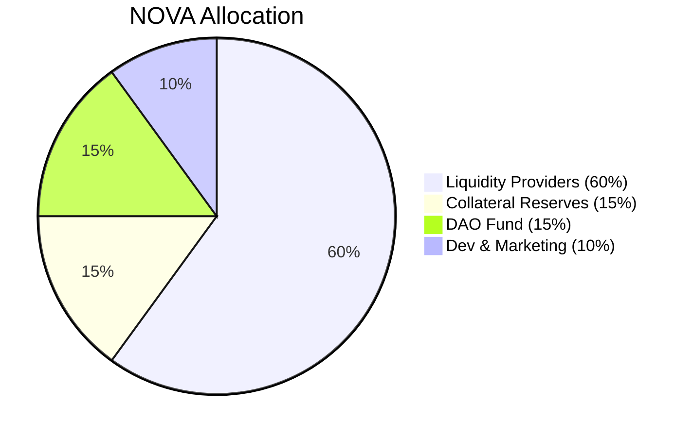
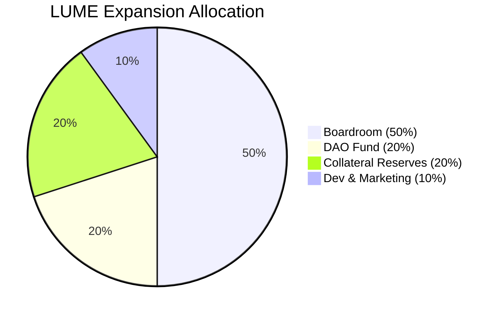

# LumeFi: Radiating Stability & Innovation on Cronos  
## Official Launch Announcement & Updated Roadmap

We're thrilled to announce the official launch of **LumeFi**, a next-generation DeFi protocol on the Cronos network. LumeFi combines AI-driven governance, elastic supply tokenomics, and robust CRO collateralization, creating a resilient and sustainable decentralized finance ecosystem.

---

## Launch Timeline & Key Milestones

| Event                 | Date & Time (UTC)                  | Duration  |
|-----------------------|------------------------------------|-----------|
| **Genesis Pool (LUME)** | March 13, 2025, 12:00 PM         | 15 days   |
| **NOVA Farming Pool**   | March 18, 2025, 12:00 PM         | Ongoing   |
| **Boardroom Launch**    | March 20, 2025, 12:00 PM         | Ongoing   |

---

## Genesis Pool Reward Details

**Duration:** March 13–28, 2025 (15 days)

| Period          | LUME Rewards      | Withdrawal Fee |
|-----------------|-------------------|----------------|
| Days 1-5        | 600,000 LUME      | 3%             |
| Days 6-10       | 400,000 LUME      | 2%             |
| Days 11-15      | 200,000 LUME      | 1%             |
| After March 28  | No additional rewards | No fee      |

Withdrawal fees collected during Genesis will directly fund LUME’s peg stability via CRO collateral.

---

## NOVA Farming Pool

- **Starts:** Tuesday, March 18, 2025 (12:00 PM UTC)
- **PSM Fees:** 15% (Week 1), 30% thereafter, adjustable by NOVA governance.

All collected CRO reinforces the Collateral Reserves to maintain LUME's peg stability.

---

## Boardroom (NOVA Staking & Rewards)

The Boardroom opens exactly one week after Genesis starts, on **Thursday, March 20, 2025, at 12:00 PM UTC**.

### Mechanics:
- **Staking & Unstaking:** Completely fee-free.
- **Withdrawal Waiting Period:** 8 epochs (48 hours), cancellable anytime with immediate restaking option.

### Reward Claim Structure:
- **Reward Claim Lock:** 2 epochs after staking/claiming.
- **Reward Expiry:** Rewards expire after 60 hours if unclaimed (automatically burned).

**Claim Options:**
- **Claim with Burn:** Instantly receive 55% of rewards (45% burned).
- **Claim with PSM Fee:** Receive 100% rewards immediately, paying a 30% fee in CRO (adjustable by NOVA governance).

### Loyalty Discounts (CRO fee):
- Stake NOVA continuously >= 15 days (60 epochs): **10% discount**
- Stake NOVA continuously >= 45 days (180 epochs): **20% discount**

---

## System Overview Diagram

---

## System Overview (Simplified)

- Users deposit liquidity (CRO) into the Genesis pool and farming pools.
- Users earn LUME and NOVA tokens.
- NOVA tokens can be staked in the Boardroom for additional rewards.
- Rewards can be claimed instantly (55% immediate, 45% burned) or fully (100%) by paying a CRO fee that supports the collateral pool.
- Collateral Reserves supports the LUME peg directly with real CRO reserves.

---

## Tokenomics Overview

### LUME Token (Elastic Supply):
- **Pegged to CRO**
- **Daily Rebase:** Automatically adjusts supply (up to +1% expansion / -2% contraction) if TWAP deviates from the peg range (0.96–1.08 CRO).

### NOVA Token (Governance Token):  
**Max Supply:** 210,000 NOVA  

**NOVA Allocation:**
- **60%** Liquidity Providers (126,000 NOVA), distributed over 2 years, AI-governed.
- **15%** Collateral Reserves (31,500 NOVA), linear vesting over 2 years.
- **15%** DAO Fund (31,500 NOVA), linear vesting over 2 years.
- **10%** Dev & Marketing (21,000 NOVA), linear vesting over 2 years.

---

## LUME Expansion Allocation (When Above Peg)

| Allocation              | Percentage |
|-------------------------|------------|
| **Boardroom Rewards**   | 50%        |
| **Collateral Reserves**     | 20%        |
| **DAO Fund**            | 20%        |
| **Dev & Marketing**     | 10%        |

---

## AI Governance & Transparency

LumeFi’s AI-driven governance dynamically manages protocol health through transparent bi-weekly updates, including:
- NOVA reward rate adjustments.
- Maximum allowed LUME expansion rates.
- Community governance oversight ensures optimal outcomes.

---

## Upcoming Enhancements

Based on expert feedback, we plan several improvements:

- **Introduction of lfUSD Stablecoin (USDC-Pegged):** Offering diversified stability and rewards.
- **Diversified Collateral:** Future integration of additional collateral types (e.g., USDC, ETH) for improved risk management.
- **Extended Reward Expiry Time & User Notifications:** Longer claim windows and notification systems to improve the user experience.
- **Enhanced Educational & Community Engagement:** Simplified onboarding resources, tutorials, FAQs, regular AMAs, and loyalty programs.

---

## How LumeFi Stands Apart

- **Real Collateral (CRO):** Tangible collateral reserves back LUME’s value.
- **Flexible Elastic Supply:** Daily rebases minimize volatility.
- **Transparent & AI-Governed Rewards:** Regular public announcements ensure clarity and community trust.
- **Innovative Claim Mechanics & Loyalty Rewards:** Unique claim options incentivize long-term ecosystem participation.

---

## Roadmap & Future Vision

Our long-term vision includes:
- **lfUSD Stablecoin** (USDC pegged).
- Multi-asset collateral integration.
- Advanced cross-chain interoperability.
- Expanded educational resources and active community governance.

---

## Connect with LumeFi:

- **Website:** [lume.finance](https://lume.finance)
- **Twitter:** *(coming soon)*
- **Telegram & Discord:** *(links coming soon)*

Together, let's illuminate the future of decentralized finance on Cronos.

**Welcome to LumeFi—Where Stability Meets Innovation!**
