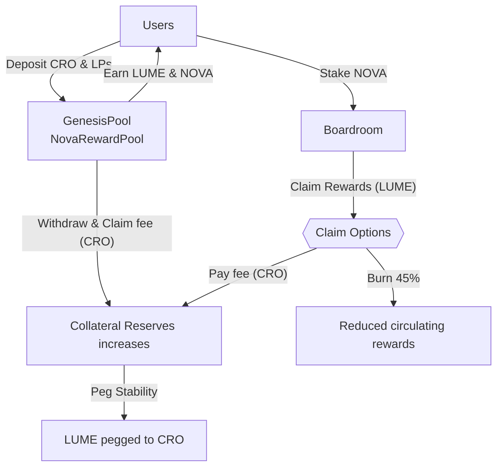
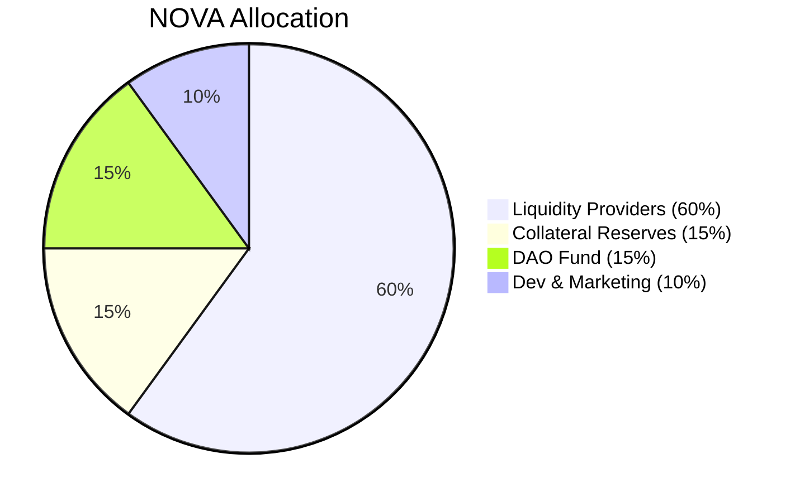
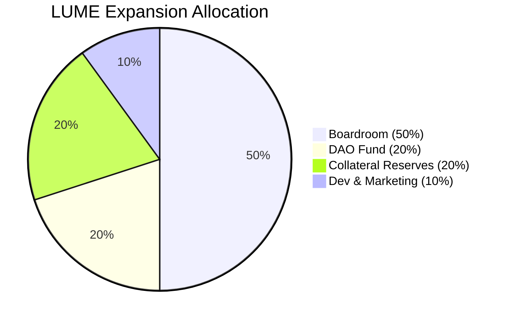

# 💎 LumeFi: Radiating Stability & Innovation on Cronos  
## 🚀 Official Launch Announcement & Updated Roadmap

We're thrilled to announce the official launch of **LumeFi**, a next-generation DeFi protocol on the Cronos network. LumeFi combines AI-driven governance, elastic supply tokenomics, and robust CRO collateralization, creating a resilient and sustainable decentralized finance ecosystem.

---

## 📅 Launch Timeline & Key Milestones

| Event                   | Date & Time (UTC)          | Duration |
|-------------------------|----------------------------|----------|
| **Genesis Pool (LUME)** | March 13, 2025, 12:00 PM   | 15 days  |
| **NOVA Farming Pool**   | March 18, 2025, 12:00 PM   | Ongoing  |
| **Boardroom Launch**    | March 20, 2025, 12:00 PM   | Ongoing  |

---

## 🎁 Genesis Pool Reward Details

**Duration:** March 13–28, 2025 (15 days)

| Period          | LUME Rewards      | Withdrawal Fee |
|-----------------|-------------------|----------------|
| Days 1–5        | 600,000 LUME      | 3%             |
| Days 6–10       | 400,000 LUME      | 2%             |
| Days 11–15      | 200,000 LUME      | 1%             |
| After March 28  | No additional rewards | No fee      |

Withdrawal fees collected during Genesis directly fund LUME’s peg stability via CRO collateral.

---

## 🌾 NOVA Farming Pool

- **Starts:** Tuesday, March 18, 2025 (12:00 PM UTC)
- **PSM Fees:** 15% (Week 1), 30% thereafter, adjustable by NOVA governance.

All collected CRO reinforces the **Collateral Reserves** to maintain LUME's peg stability.

---

## 🏛️ Boardroom (NOVA Staking & Rewards)

The Boardroom opens exactly one week after Genesis starts, on **Thursday, March 20, 2025, at 12:00 PM UTC**.

### ⚙️ Mechanics:
- **Staking & Unstaking:** Completely fee-free.
- **Withdrawal Waiting Period:** 8 epochs (48 hours), cancellable anytime with immediate restaking option.

### 🎖️ Reward Claim Structure:
- **Reward Claim Lock:** 2 epochs after staking or claiming.
- **Reward Expiry:** Rewards expire after 60 hours if unclaimed (automatically burned).

**🎯 Claim Options:**
- **Claim with Burn:** Instantly receive 55% of rewards (45% burned).
- **Claim with PSM Fee:** Receive 100% rewards immediately, paying a 30% fee in CRO (adjustable by NOVA governance).

### 🔥 Loyalty Discounts (CRO fee):
- Stake NOVA continuously ≥ 15 days (60 epochs): **10% discount**
- Stake NOVA continuously ≥ 45 days (180 epochs): **20% discount**

---

## 📊 System Overview (Simplified)

- Users initially deposit **WCRO** and selected LP tokens into the **Genesis Pool** to earn **LUME** tokens during the Genesis event.
- After Genesis, users provide liquidity pairs (**LUME/CRO** and **NOVA/CRO**) into the ongoing **NOVA Farming Pool** to earn **NOVA** tokens.
- Earned **NOVA** tokens can be staked in the **Boardroom** to continuously receive additional **LUME** rewards.
- Boardroom rewards (**LUME**) can be claimed instantly by burning 45% (receiving 55% immediately) or fully (100%) by paying a CRO fee, which directly increases the **Collateral Reserves**.
- **Collateral Reserves** ensure stability by backing the LUME peg with tangible CRO assets.

---

## 🧩 Tokenomics Overview

### 💠 LUME Token (Elastic Supply):
- **Pegged to CRO**
- **Daily Rebase:** Automatically adjusts supply (up to +1% expansion / -2% contraction) if TWAP deviates from the peg range (0.96–1.08 CRO).

### 🎖️ NOVA Token (Governance Token):  
**Max Supply:** 210,000 NOVA  

**NOVA Allocation:**
- **60%** Liquidity Providers (126,000 NOVA), distributed over 2 years, AI-governed.
- **15%** Collateral Reserves (31,500 NOVA), linear vesting over 2 years.
- **15%** DAO Fund (31,500 NOVA), linear vesting over 2 years.
- **10%** Dev & Marketing (21,000 NOVA), linear vesting over 2 years.

---

## 🚧 Robust Stability Mechanisms: How LumeFi Ensures Peg Stability

Unlike traditional algorithmic protocols that rely solely on bonding mechanisms (proven insufficient), LumeFi incorporates multiple robust mechanisms to actively maintain peg stability. Our comprehensive stability framework ensures LUME maintains its peg to CRO effectively during both expansion and contraction market conditions.

### 📈 Expansion Phase (LUME above peg):

- **Supply Expansion:** New LUME tokens are minted, increasing circulating supply and easing price pressure toward the peg.
- **Collateral Reserves & DAO Fund Action:** Excess minted LUME is strategically sold for CRO by the Collateral Reserves and DAO Fund, directly building reserves to sustain future peg stability.

### 📉 Contraction Phase (LUME below peg):

LumeFi employs multiple effective strategies (beyond outdated bonding mechanisms) to restore the peg:

- **Elastic Supply via Rebasing:**  
  Automatic daily negative rebases (up to -2%), directly reducing circulating supply and raising LUME price toward the peg.

- **Collateral-Backed Redemption:**  
  Users burn LUME tokens for direct CRO redemptions from Collateral Reserves, reducing circulating supply and stabilizing price.

- **DAO Fund Intervention (Buyback):**  
  DAO Fund strategically utilizes accumulated CRO reserves—generated during expansion—to buy back undervalued LUME tokens, providing immediate price support.

These combined mechanisms ensure LumeFi achieves superior peg stability compared to earlier pioneer projects.

---

## 📌 LUME Expansion Allocation (When Above Peg)

| Allocation             | Percentage |
|------------------------|------------|
| **Boardroom Rewards**  | 50%        |
| **Collateral Reserves**| 20%        |
| **DAO Fund**           | 20%        |
| **Dev & Marketing**    | 10%        |

---

## 🤖 AI Governance & Transparency

LumeFi’s AI-driven governance dynamically manages protocol health through transparent bi-weekly updates, including:
- NOVA reward rate adjustments.
- Maximum allowed LUME expansion rates.
- Community governance oversight ensures optimal outcomes.

---

## 🚀 Upcoming Enhancements

Based on expert feedback, planned improvements include:

- **lfUSD Stablecoin (USDC-Pegged):** Offering diversified stability and rewards.
- **Diversified Collateral:** Future integration of assets like USDC and ETH for risk diversification.
- **Extended Reward Expiry & Notifications:** Longer claim windows and automated notifications.
- **Enhanced Educational & Community Engagement:** Tutorials, FAQs, AMAs, and loyalty programs.

---

## 🌟 How LumeFi Stands Apart

- **Real Collateral (CRO):** Tangible collateral reserves backing LUME’s peg.
- **Elastic Supply (Rebase):** Daily adjustments minimize volatility.
- **Transparent & AI-Governed Rewards:** Publicly announced adjustments for trust and clarity.
- **Innovative Claim Mechanics & Loyalty Rewards:** Unique claim structures encouraging long-term ecosystem commitment.

---

## 🗺️ Roadmap & Future Vision

Our roadmap includes:
- **lfUSD Stablecoin (USDC pegged)**
- Multi-asset collateral strategies
- Advanced cross-chain interoperability
- Comprehensive community education and governance tools

---

## 🌐 Connect with LumeFi:

- **Website:** [lume.finance](https://lume.finance)
- **Twitter:** *(coming soon)*
- **Telegram & Discord:** *(links coming soon)*

Together, let's illuminate the future of decentralized finance on Cronos.

**🌟 Welcome to LumeFi—Where Stability Meets Innovation! 🌟**
